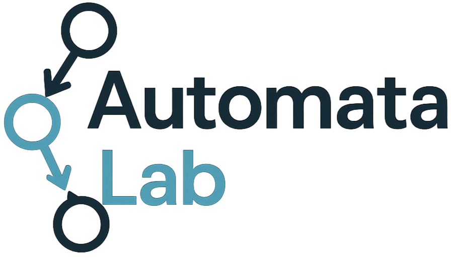

# 🚀 AutomataLab

**AutomataLab** ist eine interaktive Webanwendung zur Visualisierung und Transformation endlicher Automaten und Typ-3-Grammatiken. Sie wurde im Rahmen eines universitären Projekts mit dem Ziel entwickelt, Studierende im Fach *Theoretische Informatik und Logik (TILO)* sowie Lehrende und Interessierte bei der praxisnahen Auseinandersetzung mit formalen Sprachen und Automatenmodellen zu unterstützen.

Die Anwendung bietet Funktionen zur Erstellung, Umwandlung und Simulation von deterministischen und nichtdeterministischen endlichen Automaten (DEA, NEA), Typ-3-Grammatiken sowie zur Ausgabe in Prolog-Format. Darüber hinaus unterstützt AutomataLab die Minimierung von DEA und die interaktive Simulation von Eingabewörtern.

Die Anwendung basiert vollständig auf **Vue.js** und lässt sich lokal einfach ausführen – auch ohne tiefgehende Vorkenntnisse in Webentwicklung.

---

## ✨ Features

- Erstellung und Bearbeitung von **DEA**, **NEA** und **Typ-3-Grammatiken**
- Intuitive **graphische Benutzeroberfläche**
- Interaktive **Simulation** von Eingabewörtern mit visuellem Zustands-Feedback
- Transformationen:
  - DEA ⇄ Typ-3-Grammatik
  - Typ-3-Grammatik → NEA → DEA
  - DEA → **Prolog-Code**
- **Minimierung** deterministischer Automaten
- Fehlererkennung bei Automatendefinitionen
- Darstellung als **Zustandsdiagramm und Transitionstabelle**
- **Persistente Datenspeicherung** im Browser und Lokal

---

## 🔧 Voraussetzungen

Damit du das Projekt lokal ausführen kannst, benötigst du:

- **[Node.js](https://nodejs.org/)** (Version 16 oder höher)  
  > Node.js beinhaltet auch den Paketmanager **npm**, der ebenfalls benötigt wird.

---

## ⚙️ Projekt lokal starten

### 1. Repository herunterladen

```bash
git clone https://github.com/aliengigant/trafoweb.git
cd trafoweb
```
 ### 2. Abhängigkeiten installieren
 ```bash
npm install
```

 ### 3. Entwicklungsserver Starten
 ```bash
npm run serve
```
Nach kurzer Zeit zeigt das Terminal eine lokale Adresse an, z. B.:
Localhost:  http://localhost:8080/

---
## ❓ Häufige Fragen
**Ich kenne mich mit Vue nicht aus – was muss ich beachten?**

Kein Problem! Du musst kein Vue-Experte sein, um die Anwendung zu starten oder zu nutzen. Du brauchst nur Node.js und den Paketmanager npm. Die Anwendung ist bereits vollständig programmiert – du musst nichts anpassen, nur ausführen.

## 👤 Autor
Dieses Projekt wurde im Rahmen eines Universitätsprojekts entwickelt von:

Hakan

GitHub: https://github.com/aliengigant/AutomataLab
